## 0. 开始之前

本期文档的主要内容是在moveit中配置机械臂模型，并在gazebo和rviz中实现机械臂仿真和简单运动。

开始之前，请先[安装moveit](http://docs.ros.org/en/melodic/api/moveit_tutorials/html/doc/getting_started/getting_started.html)（已安装可忽略此步）：

```bash
$ sudo apt install ros-melodic-moveit
```

**注意：**安装过程中可能出现缺少依赖的情况，按照终端提示安装相应依赖包即可。

完整代码已在GitHub仓库中给出，如果仅仅需要看到最终效果，则可以直接跳转至[启动机械臂](#jump)。若想了解整个过程，可以删除相关文件自行配置一遍。

本期文档涉及到的文件（目录）有：

- amazerobot/AerialManipulator/marm_moveit_config
- amazerobot/AerialManipulator/mobot_urdf/marm_trajectory_control.yaml
- amazerobot/AerialManipulator/mobot_urdf/arm_gazebo_joint_states.yaml
- amazerobot/AerialManipulator/mobot_urdf/marm_gazebo_states.launch
- amazerobot/AerialManipulator/mobot_urdf/marm.launch

## 1. 启动moveit，配置机械臂模型

### 1.1启动moveit

在终端执行：

```bash
$ roslaunch moveit_setup_assistant setup_assistant.launch
```

不出意外将看到moveit启动界面：              

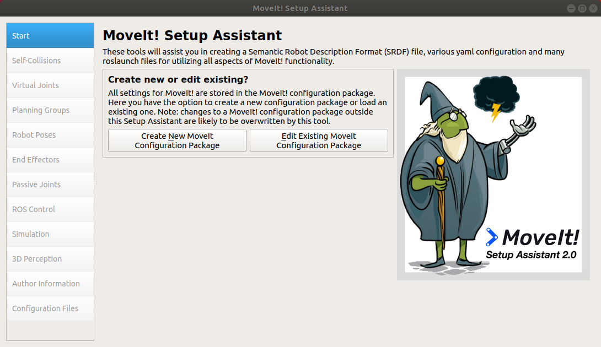

### 1.2 配置机械臂模型

如下图所示，选择`Create New Moveit Configuration Package `，之后选择机械臂模型文件的加载路径:`<your_ros_workspace_path>/src/mobot_urdf/urdf/arm.xacro`，点击`load`即可在moveit界面中看到该机械臂模型：

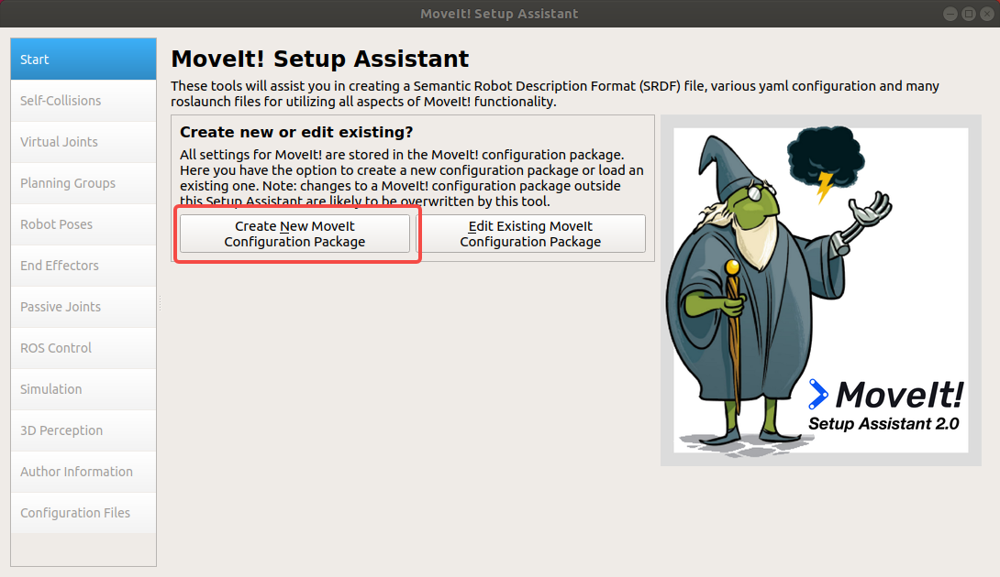

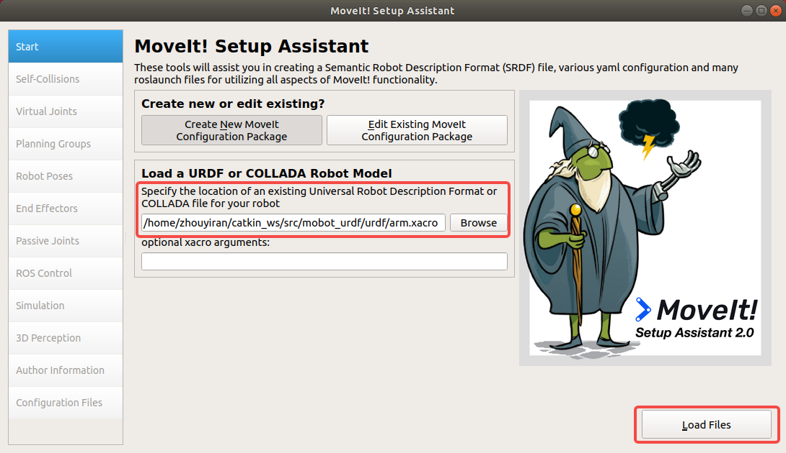

当前的机械臂模型还只是静态模型，无法运动，我们可以通过moveit的一些配置使机械臂动起来。

#### 1.2.2 创建规划组

模型文件加载完毕之后，便可看到moveit中的配置界面：

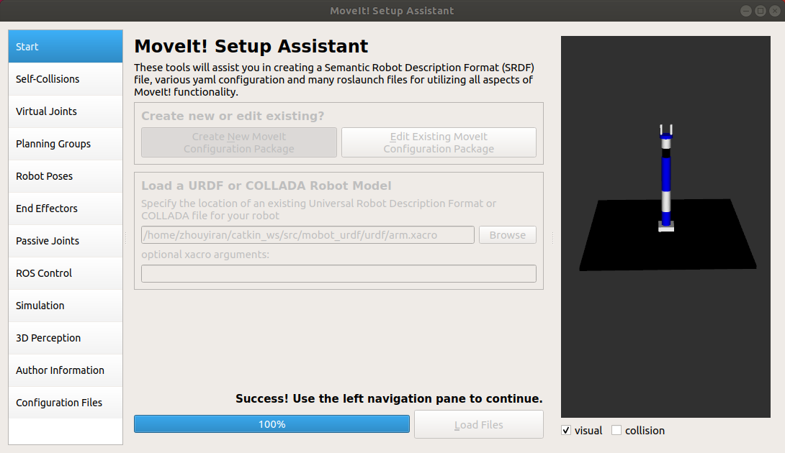

选择当前界面左侧选项卡中`Planning Groups`一项设置规划组。机械臂模型中共有两个规划组，分别是连杆部分（arm）和抓手部分（gripper），需要在moveit中依次创建它们。

点击右下角`Add Group`按钮新建arm规划组。如下图，我们将该规划组命名为arm，动力学求解器选择kdl：

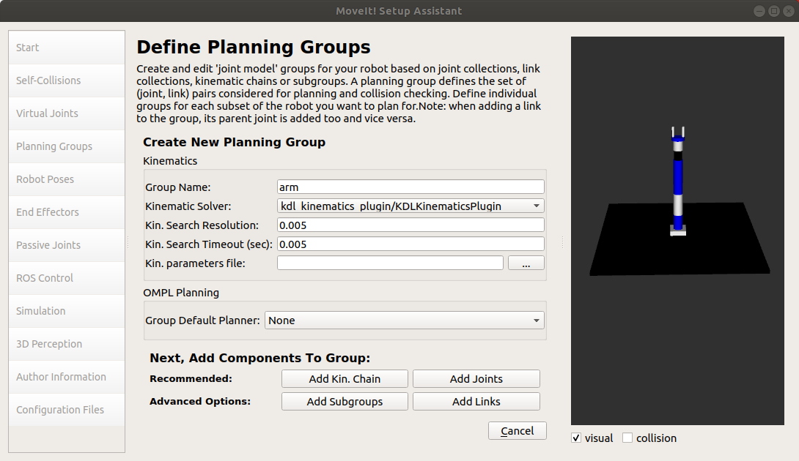

接着，我们将为arm规划组添加其他组件，点击规划组创建界面中右下角`Add Kin.Chain`按钮，为机械臂连杆添加铰链。如下图，选择Base Link为base_link，Tip Link为link6：

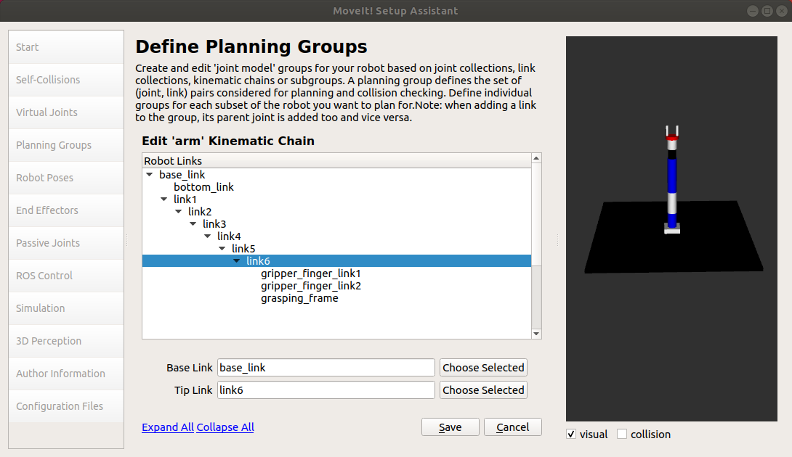 

同理，我们可以创建gripper规划组：

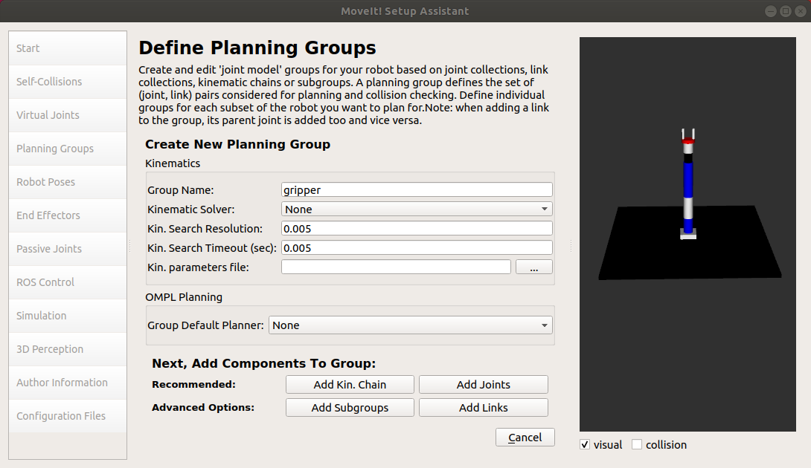

**注意**：gripper部分并不涉及运动规划，故动力学求解器选择**None**即可。

为gripper规划组添加关节，选择`Add joints`，将finger_joint1和finger_joint2添加到`Selected Joints`中:

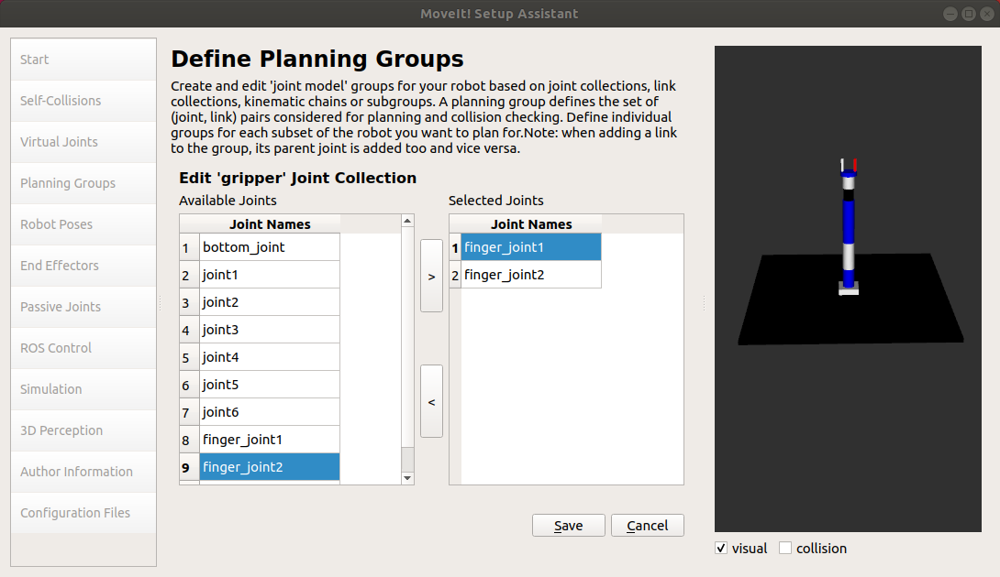

至此，规划组创建完毕。

#### 1.2.3 定义机械臂姿态

选择`Robot Poses`定义机械臂姿态。点击`Add Pose`， 便可生成机械臂的某种姿态。例如，定义当前pose名为init， 各个关节位置参数都为初始0值：

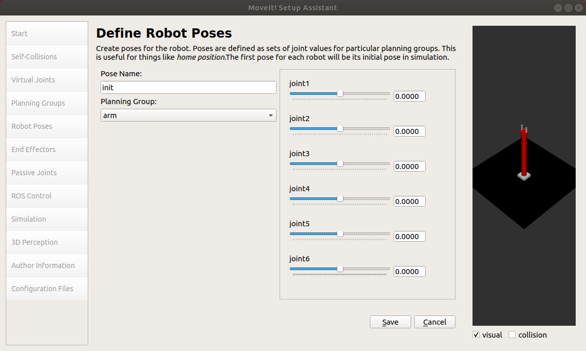

同理，可以在界面中随意拖动不同关节的位置去生成机械臂的其他姿态(该例子中生成了p1, p2)：

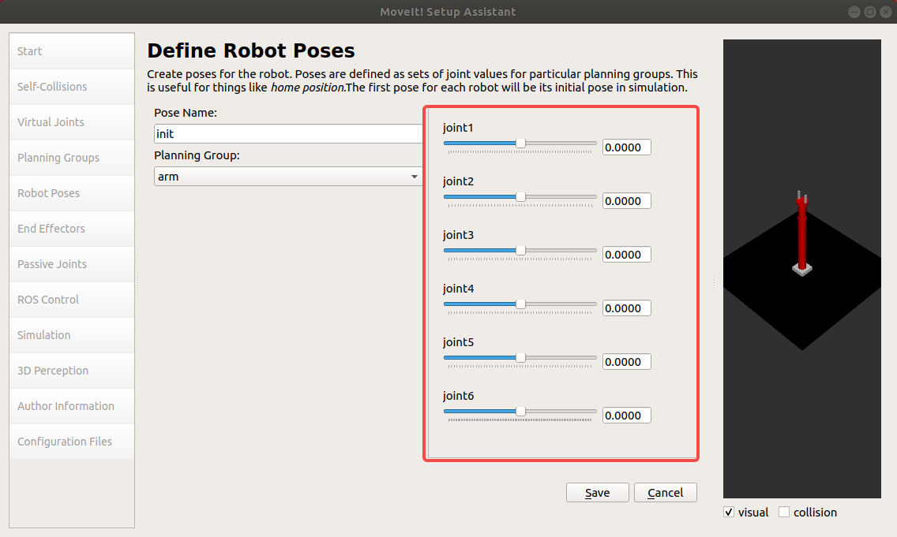

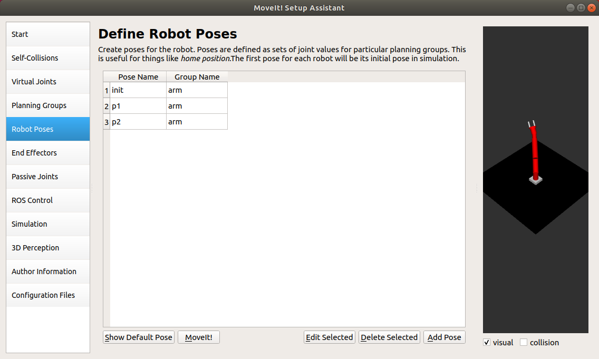

#### 1.2.4 添加末端执行器

选择` End Effectors`定义机械臂姿态。点击`Add End Effector`，定义当前执行器名为arm_gripper，所属gripper规划组，Parent Link为grasping_frame:

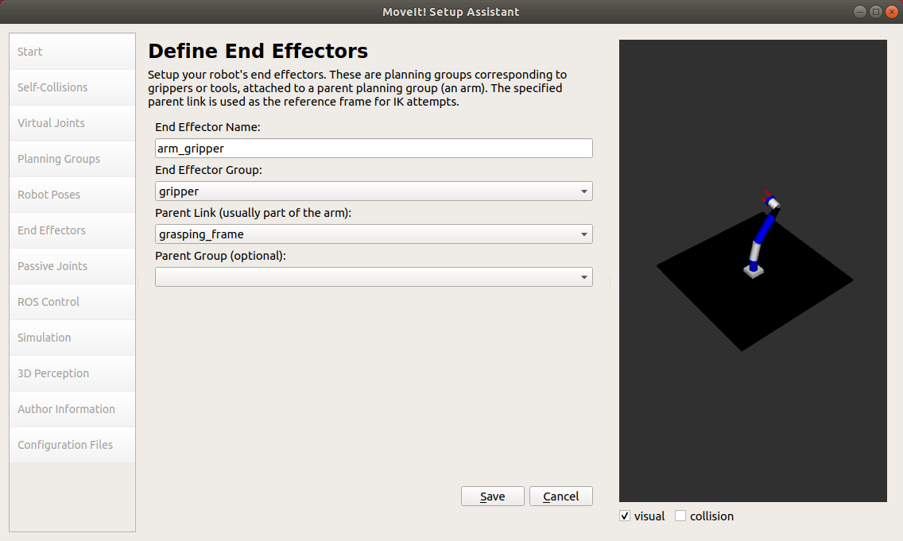

#### 1.2.5 生成urdf模型文件

moveit中可以直接为配置好的机械臂模型生成模型文件。选择`Simulation`，点击`Generate URDF`可以为当前机械臂生成urdf模型：

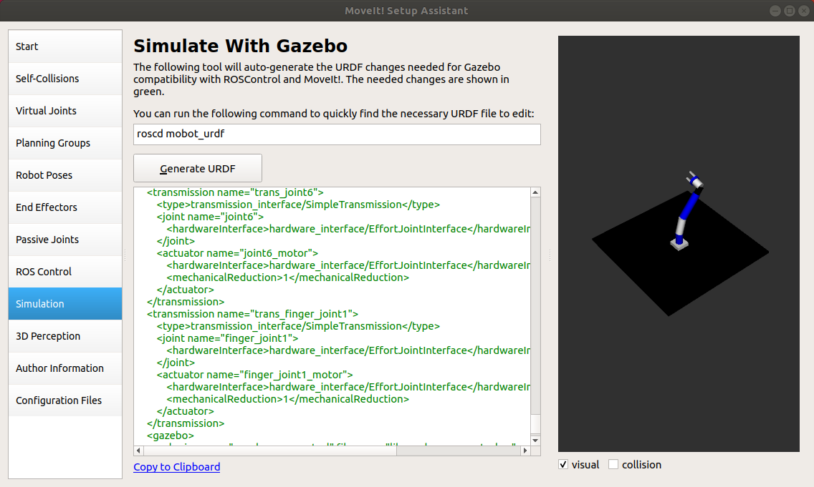

#### 1.2.6 填写作者信息

选择`Author Information`生成作者信息。该步请不要跳过，否则无法生成配置文件。

#### 1.2.7 生成机械臂配置文件

选择`Configuration FIles`生成配置文件（请事先在ROS工作空间的src目录下新建marm_moveit_config文件夹）。

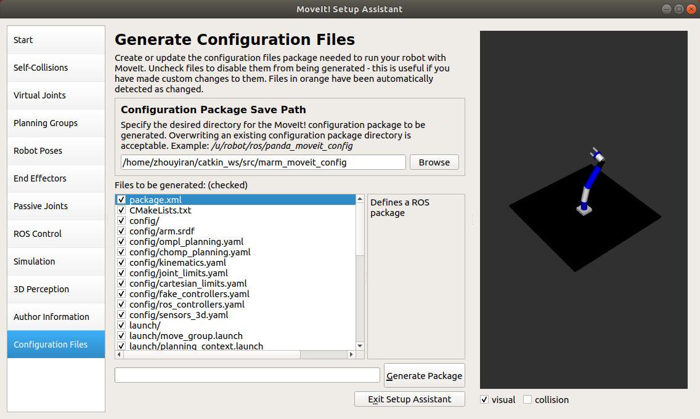

## 2. 修改配置文件包

经过上面的工作，marm_moveit_config文件包应该如下图所示：

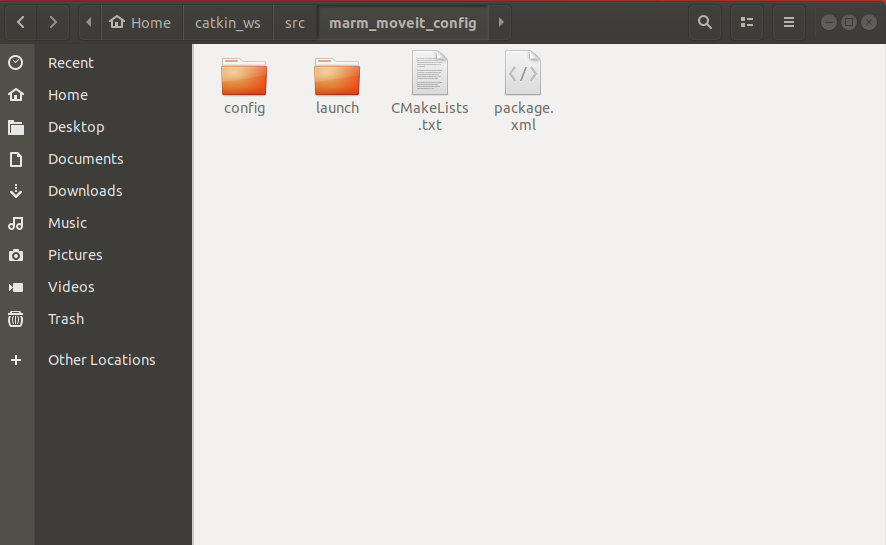

现在要对该文件夹内容做必要修改，之所以要进行这一步是因为moveit直接生成的配置文件包无法直接在ros中运行，相关错误在Ubuntu 16.04就已出现，至今还没有修复，故需要对配置文件进行手动修改。

### 2.1 修改ros_controllers.yaml

该文件位于`marm_moveit_config/config`目录下，首先进入该目录：

```bash
$ cd <your_ros_workspace_path>/marm_moveit_config/config
```

找到ros_controllers.yaml文件，将文件中的内容替换成：

```yaml
controller_manager_ns: controller_manager
controller_list:
  - name: arm/arm_joint_controller
    action_ns: follow_joint_trajectory
    type: FollowJointTrajectory
    default: true
    joints:
      - joint1
      - joint2
      - joint3
      - joint4
      - joint5
      - joint6

  - name: arm/gripper_controller
    action_ns: follow_joint_trajectory
    type: FollowJointTrajectory
    default: true
    joints:
      - finger_joint1
      - finger_joint2
```

### 2.2 新建moveit_planning_execution.launch文件

在`marm_moveit_config/launch`目录下新建该文件：

```bash
$ cd <your_ros_workspace_path>/marm_moveit_config/launch
$ gedit moveit_planning_execution.launch
```

文件内容为：

```xml
<launch>
 # The planning and execution components of MoveIt! configured to 
 # publish the current configuration of the robot (simulated or real)
 # and the current state of the world as seen by the planner
 <include file="$(find marm_moveit_config)/launch/move_group.launch">
  <arg name="publish_monitored_planning_scene" value="true" />
 </include>
 # The visualization component of MoveIt!
 <include file="$(find marm_moveit_config)/launch/moveit_rviz.launch"/>

  <!-- We do not have a robot connected, so publish fake joint states -->
  <node name="joint_state_publisher" pkg="joint_state_publisher" type="joint_state_publisher">
    <param name="/use_gui" value="false"/> 
    <rosparam param="/source_list">[/arm/joint_states]</rosparam>
  </node>

</launch>
```

**注意**：

至此，配置文件包marm_moveit_config已完成修改。

## 3. 创建启动文件

### <span id="jump2">3.1 新建marm_trajectory_control.yaml和arm_gazebo_joint_states.yaml文件</span>

在编写启动文件之前，需要在`mobot_urdf`包中创建两个必要的配置文件。

首先，在`mobot_urdf/config`目录下新建配置文件marm_trajectory_control.yaml：

```bash
$ cd <your_ros_workspace_path>/mobot_urdf/config
$ gedit marm_trajectory_control.yaml
```

文件内容为：

```yaml
arm:
  arm_joint_controller:
    type: "position_controllers/JointTrajectoryController"
    joints:
      - joint1
      - joint2
      - joint3
      - joint4
      - joint5
      - joint6

    gains:
      joint1:   {p: 1000.0, i: 0.0, d: 0.1, i_clamp: 0.0}
      joint2:   {p: 1000.0, i: 0.0, d: 0.1, i_clamp: 0.0}
      joint3:   {p: 1000.0, i: 0.0, d: 0.1, i_clamp: 0.0}
      joint4:   {p: 1000.0, i: 0.0, d: 0.1, i_clamp: 0.0}
      joint5:   {p: 1000.0, i: 0.0, d: 0.1, i_clamp: 0.0}
      joint6:   {p: 1000.0, i: 0.0, d: 0.1, i_clamp: 0.0}


  gripper_controller:
    type: "position_controllers/JointTrajectoryController"
    joints:
      - finger_joint1
    gains:
      finger_joint1:  {p: 50.0, d: 1.0, i: 0.01, i_clamp: 1.0}
```

同理，在同一目录下新建arm_gazebo_joint_states.yaml，文件内容为：

```yaml
arm:
  # Publish all joint states -----------------------------------
  joint_state_controller:
    type: joint_state_controller/JointStateController
    publish_rate: 250  
```

**注意：**也可以在其他目录下新建这两个文件，但需要在相关launch文件（marm_gazebo_states.launch）中修改加载路径。

### 3.2 创建marm_gazebo_states.launch和marm.launch文件

在终端执行：

```bash
$ cd <your_ros_workspace_path>/mobot_urdf/launch
$ gedit marm_gazebo_states.launch
```

文件内容为：

```xml
<launch>
    <!-- 将关节控制器的配置参数加载到参数服务器中 -->
    <rosparam file="$(find mobot_urdf)/config/arm_gazebo_joint_states.yaml" command="load"/>

    <node name="joint_controller_spawner" pkg="controller_manager" type="spawner" respawn="false"
          output="screen" ns="/arm" args="joint_state_controller" />

    <!-- 运行robot_state_publisher节点，发布tf -->
    <node name="robot_state_publisher" pkg="robot_state_publisher" type="robot_state_publisher"
        respawn="false" output="screen">
        <remap from="/joint_states" to="/arm/joint_states" />
    </node>


    <rosparam file="$(find mobot_urdf)/config/marm_trajectory_control.yaml" command="load"/>

    <node name="arm_controller_spawner" pkg="controller_manager" type="spawner" respawn="false"
          output="screen" ns="arm/" args="arm_joint_controller"/>
    <node name="gripper_controller_spawner" pkg="controller_manager" type="spawner" respawn="false"
          output="screen" ns="arm/" args="gripper_controller"/>


</launch>
```

**注意**：可以看到该launch文件加载了[3.1](#jump2)中创建的两个配置文件，请注意路径是否一致。除此之外，该文件中生成了连杆（arm）和抓手（gripper）

两个部分的控制器，实际只用到了连杆部分。

在同一目录下，创建marm.launch文件，文件内容是：

```xml
<launch>
 
    <arg name="x" default="0"/>
    <arg name="y" default="0"/>
    <arg name="z" default="0"/>
    <arg name="R" default="0"/>
    <arg name="P" default="0"/>
    <arg name="Y" default="0"/>
 
    <arg name="robot_description" default="robot_description"/>

 
    <!-- gazebo configs -->
    <arg name="gui" default="true"/>
    <arg name="debug" default="false"/>
    <arg name="verbose" default="false"/>
    <arg name="paused" default="false"/>
    <arg name="respawn_gazebo" default="false"/>
 
 
    <!-- Gazebo sim -->
    <include file="$(find gazebo_ros)/launch/empty_world.launch">
        <arg name="gui" value="$(arg gui)"/>
        <arg name="debug" value="$(arg debug)"/>
        <arg name="verbose" value="$(arg verbose)"/>
        <arg name="paused" value="$(arg paused)"/>
        <arg name="respawn_gazebo" value="$(arg respawn_gazebo)"/>
    </include>

   <param name="robot_description" command="$(find xacro)/xacro --inorder '$(find mobot_urdf)/urdf/arm.xacro'"/>
   <node name="urdf_spawner" pkg="gazebo_ros" type="spawn_model" respawn="false" output="screen"
     args="-urdf -model arm -x 0 -y 0 -z 0 -param robot_description"/>

    <!-- ros_control arm launch file -->
    <include file="$(find mobot_urdf)/launch/marm_gazebo_states.launch" />   

    <!-- moveit launch file -->
    <include file="$(find marm_moveit_config)/launch/moveit_planning_execution.launch" />

 <node pkg="rviz" type="rviz" name="rviz" args="-d $(find mobot_urdf)/urdf/3-axis/test.rviz"/>

</launch>
```

## <span id="jump">4. 启动机械臂</span>

**注意**：如果未执行如上步骤，请确保将mobot_urdf和marm_moveit_config包复制到ROS工作空间中的src目录下。

在终端执行：

```bash
$ cd <your_ros_workspace_path>
$ catkin_make # 编译工作空间
$ roslaunch mobot_urdf marm.launch # 加载机械臂                                                                                    
```

将会看到如下界面：

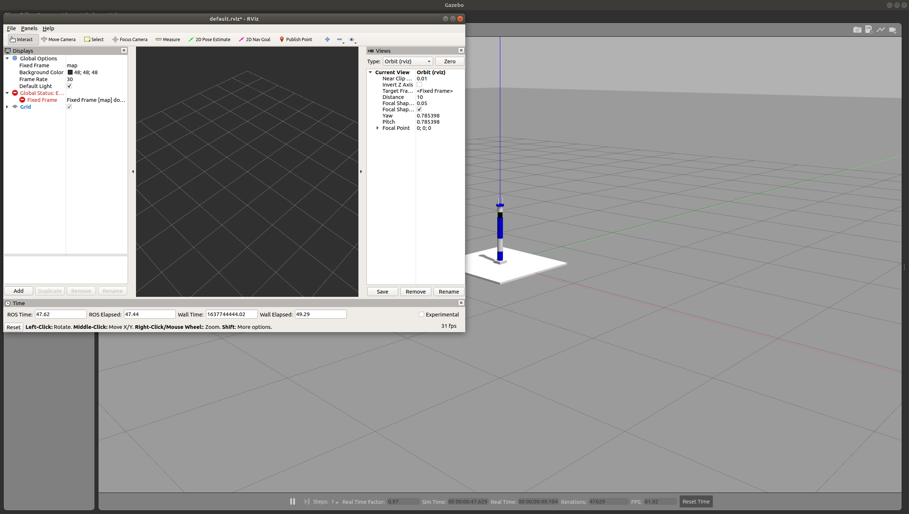

可以看到当前启动了gazebo和rviz，接着点击rviz界面右下角`add`按钮，添加moveit插件：

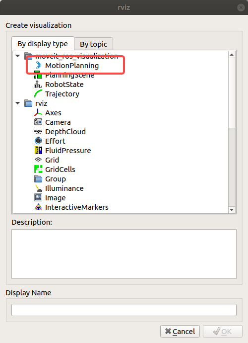

添加插件之后，会在rviz界面中看到机械臂模型。使用rviz指定机械臂的始末位置，rviz将给出运动的合理性信息及运动规划的可视化结果，例如：

- 在rviz界面中的Display窗口，`Global Options`下的`Fixed Frame`设置为base link，这时可以在机械臂抓手之间看到一个可拖动的小球。
- 在`MotionPlanning`窗口，`Start State`和`Goal State`都设置为home
- 随意拖动小球改变机械臂运动姿态（**注意机械臂主体不能有红色部分，否则无法进行下一步**）
- 点击`Plan & Execute`进行运动规划，此时机械臂便可从home状态运动到指定姿态（gazebo和rivz中可以同步看到机械臂的运动情况）。

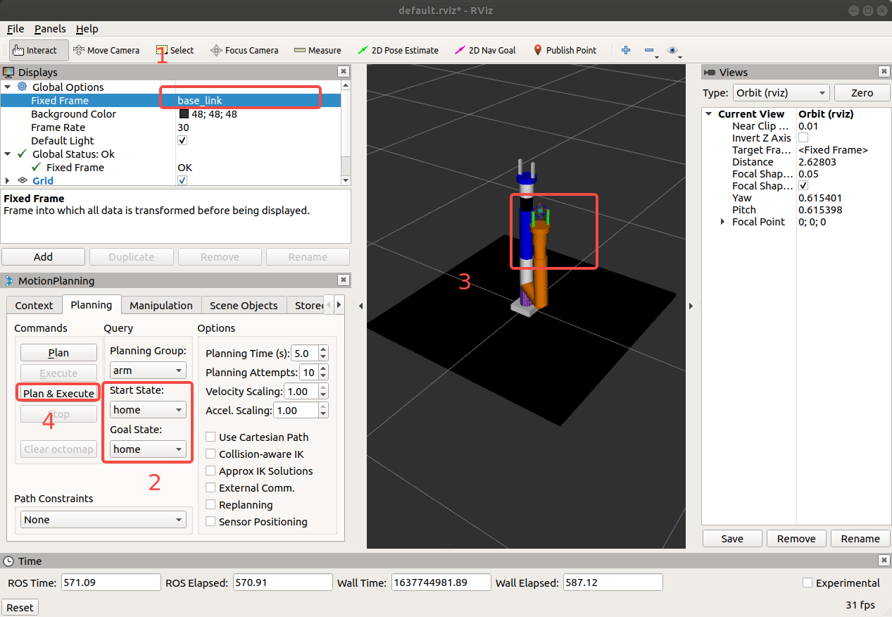